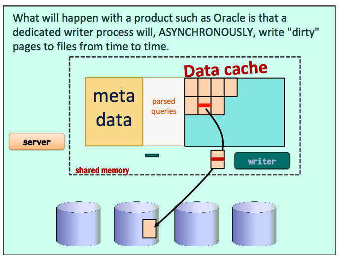
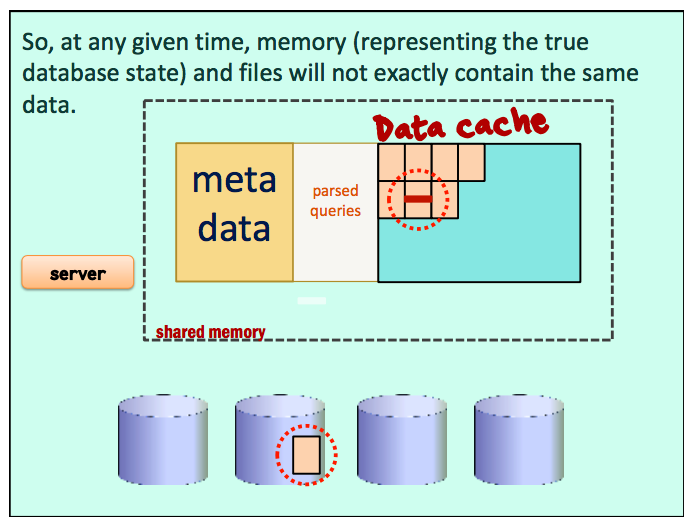
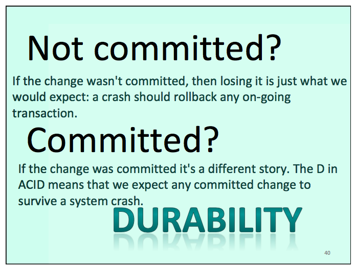
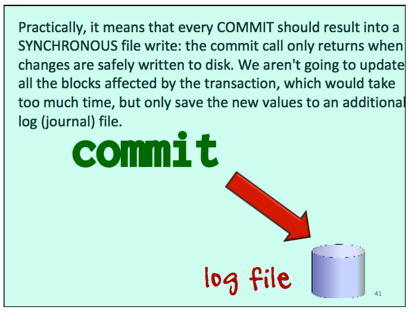
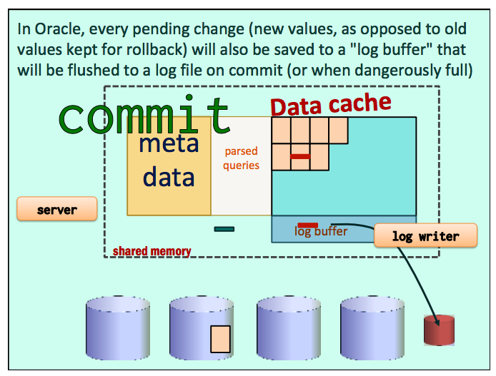
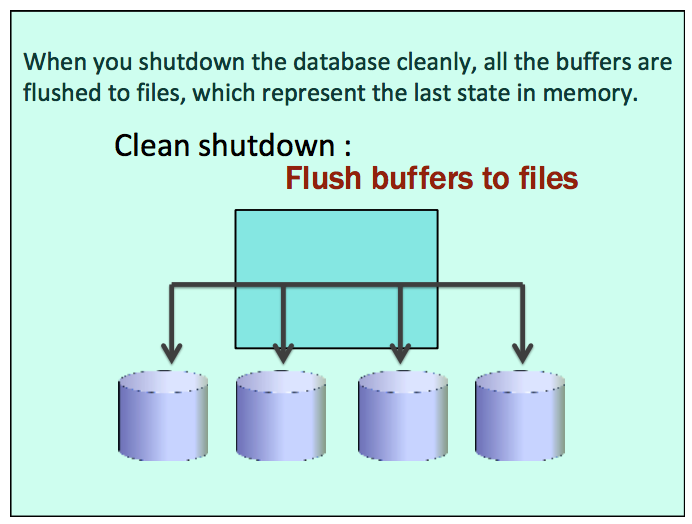

# Lecture 10

## Parsing

~ Dynamic compilation

### Query Optimizer

Parsing takes time.

Keep pearsed queries in memory.

#### Query cache management

Least Recently Used (LRU)

Checksum + check tables are same and context identical

Selectivity?

**SEVERAL problems**

Atomicity Transactions (rollback)

Durability
Persistence
Consistency

Isolation Concurrency

### ACID

- Atomicity

Related to a transaction, seen as a single unit.

- Consistency

Data should always be seen as consistent (constraints)

- Isolation

When one user changes data, it should not make it inconsistent to others

- Durability

When something is saved to a database, it should become persistent, whatever happens

#### What about several sessions?

**Dedicated Sessions**

Assign to all connected users their own personal server process running SQL for them.

**Session Pooling**

Pre-start (which makes connection slightly faster) a number of servers, and to assign requests to them with a bit of load-balancing.

#### What about a session querying data being changed by another session?

**See slides.**

CONSISTENT STATE

> In practice, the problem is more a problem of data consistency of foreign keys when we are scanning big related tables. A single SELECT will usually be consistent (a product such as Oracle ignores any change having happened since the start of the SELECT, even if it was committed). But if we SELECT twice (two different queries) from two tables with an FK relationship, changes that may have happened (and have been committed) between the time when we started reading the first table and the time when we were reading the second table may lead to problems such as orphaned rows.

#### BACKUP ISSUES

#### SCALING UP

Adding servers

Neil Gunther’s
Universal Law of Computational Scalability

# Lab 11

## Data Dictionary / Catalog

A set of tables that contain information about the objects in the database.

One catalog per database.

### System tables

Any database stores "metadata" that describes the tables in your database (and not only them).

All client tools use this information to let you browse the structure of your tables

Whenever you are issuing DDL commands, you are actually modifiying system tables. They must NEVER be directly changed.

Read access to these tables is provided through system views.

In these views you only see what YOU are allowed to see. Only administrators see everything.

#### Most important tables for developers in `INFORMATION_SCHEMA` (PostgreSQL version)

- `TABLES`
- `COLUMNS`
- `TABLE_CONSTRAINTS`
- `CONSTRAINT_COLUMN_USAGE`
- `KEY_COLUMN_USAGE`
- `CHECK_CONSTRAINTS`

`SEQUENCES` `ROUTINES` `TRIGGERS` `VIEWS`

`VIEW_TABLE_USAGE`

Those are all views you should be aware of.

**Nothing on indexes not associated with PK or UNIQUE constraint!**

Must look into `pg_catalog`.

- `pg_index`
- `pg_class`
- `pg_attribute`

#### Stuff mostly for DB administrators

Roles and privileges

- `pg_class` relates tables to files on disk
- `pg_statistic` estimates used by the optimizer
- `pg_settings` database parameters

...
