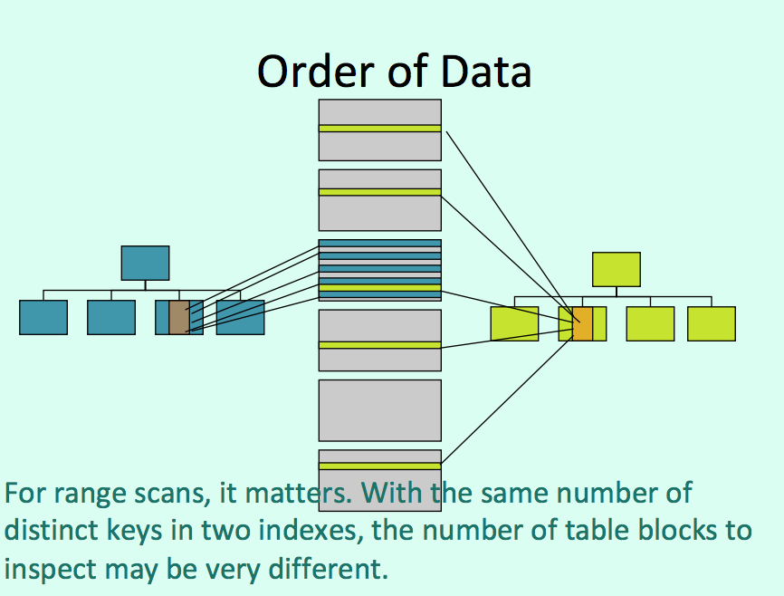
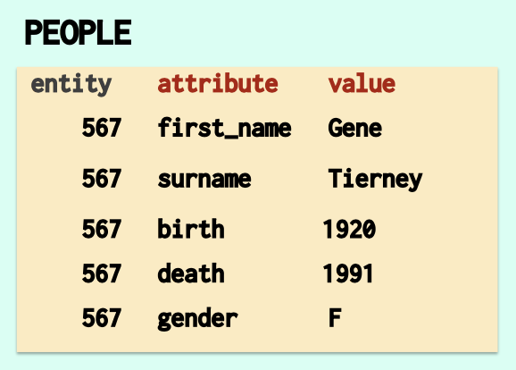

# Lecture 13

Disaster Receovery

Switch

Diagnosis?

Decision taking?

Test recovery

Logical vs Physical backup

## Database hangs

Deadlocks

Indexes

# Lecture 13

## Disaster Receovery

### To remember

- Logical vs physical backup
- Cold vs hot backup
- Synchronous vs asynchronous
- Replication
- Arbitrage - you can't have everything

## Performance

- Database hangs
- Sluggish queries

### Deadlocks

A deadlock is what happens when two transactions are getting an exclusive lock on a resource and mutually need another lock on the resource held by the other transaction.

Anonying, but a problem for developers, not DBAs.

### File-system full

- Log Archival inactive/blocked (Oracle)

### Slowness

- Perceived slowness

slower than the expectations of the user

- Load

slowness due to an increased load on the system

Navie approach
- More Hardware (Kill It With Iron approach)

Expensive, disruptive, often disappointing

- Adding indexes everywhere

Useless indexes are far more common than missing indexes.

- Can we tune the database? (Magic Parameter Dance)
- What are the slow queries?

Expectations

- Slowness is a problem only when it could and should be fast.
- You cannot aggregate 5 billion rows fast.

Modeling?

If you spend your time aggegating data it’s perhaps that your database model isn’t suitable for what you want to do. Database design is very important for performance.

### Correct starting-point

The correct approach is to find out **WHERE you have a problem; which is the resource that fails you**.

#### Waits

Waits will tell you where problems are building up in a system.

**Response Time = Processing Time + Wait time**

Information about waits and bottlenecks can usually be found in
`Dynamic Views`, which are the table representation of counters in memory.

Tools are available for real-time monitoring with big products, but there are several problems with these tools and the averages they show aren't always very meaningful.

Tracing: hard to do on a production database

#### Configuration mistakes
- Not enough server processes (pooling)
- Bad network configuration
- Buffers far too small
- Journal files on slow or busy disks

#### Query execution
- **Physical reads** Read pages from disk (I/Os)
- **Logical reads** Inspect pages in memory

When a query executes, it can access pages on disk (physical I/Os) or in memory (logical I/Os).
> For many years people thought that as long as you had 10 LIOs for 1 PIO, everything was fine. Forget ratios.

#### Logical reads - CPU intensive

The number of logical reads is the indicator that really counts. Logical reads are CPU-intensive. If the number of memory blocks accessed times the size of the memory block is far greater than the size of the tables involved in the query, you have a problem.

#### How to optimize queries that cannot be changed?

- Don't do what isn't necessary
- Schedule at another time

#### Parsing issues

> When people hard-code search criteria in queries (concatenating constants in queries instead of using prepared statements with parameters), not only do they open the door to SQL injection but every query for which only constants are different appears as a new query that has to be parsed.

Force substitution of constants by variables

Oracle, SQL Server

Because SQL is declarative, the optimizer, which decides on how queries should be executed, has a very important role.

When the optimizer finds a criterion such as `where column_name = 'value'` it needs to check a few things about the column.

- Is there an index?

The optimizer won't create indexes for you.

- Can it be used?

If the index is on `(other_column, column_name)` and there is no condition on `other_column` ...

- Is it worth using?

If 60% of rows contain `'value'` in `column_name`, probably not.

**Execution plan**

`explain` -> index used?

The optimizer bases decisions on Statistics.

#### Histogram issues

Using far away values

Oracle doesn't index nulls. People often prefer using a dummy, far away date that can be indexed.

#### False Range scan

A true range scan is when you ask for values in a column that are between two constant (or computed) values. With histograms, the optimizer can get a fairly good idea of the number of rows returned.

`where event_date between sysdate -7 and sysdate`

A false range scan looks deceivingly like a real one, except that here you are comparing ONE constant to TWO columns instead of the reverse.

`where sysdate between start_date and end_date`

What you are really doing is taking the intersect of two open-ended intervals. And here, getting an estimate of the number of rows is FAR more difficult, and indexes won't help much.

`where sysdate >= start_date and sysdate <= end_date`

It's a problem that is commonly encountered, as soon as you have a "from" column and a "to" column.

### Distinct keys

one composite index better than several single-column indexes

> But remember that if there is no condition on the first column in the index you cannot walk the tree ...

### Clustering factor

a metric obtained by taking all keys (of the same index) in order, and checking whether the row associated with a key is in the same block than the row associated with the previous key. If not, we increase the factor.

If the clustering factor is close to the number of rows in the table, that means that two successive keys are generally in different blocks.

If it's close to the number of blocks in the table, it means that the rows are more or less in the same order as the keys.

For range scans, it matters. With the same number of distinct keys in two indexes, the number of table blocks to inspect may be very different.

**Lower clustering factor = Fewer blocks to fetch and inspect.**

### Plan Instability

A product such as Oracle tries to remedy to this problem by keeping watch over queries that exhibit instability and reparsing them more often, but it's a remedial process after the problem occurred, not a preventive one.

Most performance issues come from poor or careless (or both) development.

## Design and Statistics

### Entity/attribute/Value (EAV) Model

An EAV model will underestimate volumes and pick on indexes and algorithms that use indexes.

Hence the benefit of "**extended statistics**" (which only the top products such as Oracle allow), not only to detect genuine correlation in the data (such as between "born" and "died") but also to try to correct artificial correlation introduced by the data model (because any value cannot be associated with any attribute).

### What can the optimizer do?

One way is to use a "feedback loop" and compare actual to predicted performance.

One problem of course is this is a reactive, and not proactive, plan improvement (it means that you know of the problem only when it has occurred).

And the same execution plan may, depending on parameters associated with a query, be very good in one case and very bad in another case.

### Adaptative Cursor Sharing (Oracle)

Oracle has introduced a mechanism in version 11. If a parameter is bound as a search criterion and there is a histogram that indicates possible problem, a query is checked. If a problem occurs, the plan will be re- evaluated when parameters change.

### "Recompile" directive in SQL statement (SQL Server)

SQL Server has a slightly cruder mechanism, a directive that you can add to a problem query that asks for it to be recompiled at each execution. Note that it must be in the code, so the DBA cannot do much there.

### Dynamic sampling

An interesting, and often effective, feature in Oracle is "dynamic sampling" which basically asks the optimizer to guess less and check data a bit more.

## A Developer perspective

(Full ctonrol of the application)

### Fundamentals

#### Database Design

Many people forget that performance is something that comes straight from design.

Querying reasonably efficiently badly designed tables often requires acrobatic SQL that few people are able to write.

### Dimensional Model

When you overdo everything and want a model that can handle anything, usually there is one thing that it doesn't handle well: load.

Such an example is the Entity/Attribute/ Value (or EAV) model, which is supposed to handle even the cases you hadn't thought of.

> You have no nulls in such a model, and some people seem to be genuinely persuaded that its good relational design because of this.

> If nulls are indeed better avoided, EAV fans seem to forget that they have no data types either, because all types of values are stored in to the same (text) "value" column, and that they cannot have foreign keys, that the only thing that can be unique is (entity, attribute), and so forth.

> The EAV model is OK if you want to store parameters for your application, or perhaps for a small extension. Not if the main table in your application only has these three columns.

> An EAV table can only use indexes, even when scanning would be the right thing to do, and you will use tons of joins, very heavy on CPU. Performance plunges dramatically when volumes head up.

> Some clever SQL rewriting sometimes helps (to a limited extent), but usually people have been so clever with their EAV design that when they come to writing SQL they have exhausted all their cleverness.

...
