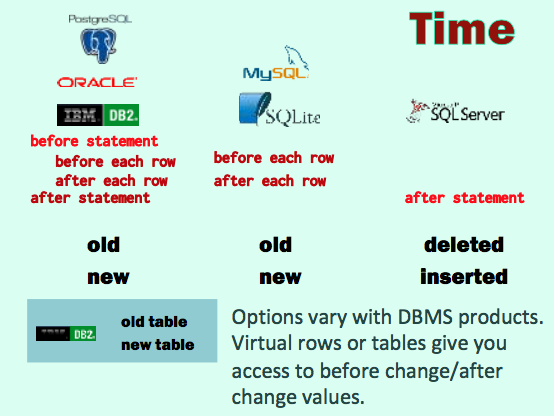

# Lecture 8

## Procedures

- Business processes
- Avoid cursors
- Use `insert` ... `select` and complex `update`s

## Triggers

For excuting stored procedures automatically.

**Fired by data changes** (never by a `SELECT`). [See below]

- Modify input on the fly
- Check complex rules
- Manage data redundancy

### Trigger Activation

Depending on what the trigger is designed to achieve, it may be fired by various events and at various possible precise moments.

  - before/after `insert` trigger
  - before/after `insert` for each row trigger

#### Time


#### Event
- `insert`
- `update`
- `delete`

Several possible triggers.

Several possible events can fire one trigger

#### PostgreSQL, Oracle, IBM DB2

Some products let you have several different events that fire the same trigger (timing must be identical).

```sql
create trigger trigger_name
before insert or update or delete
on table_name
for each row
as
begin
  ...
end
```

#### MySQL, SQLite

Other products allow only one trigger per event/timing, and one event per trigger.

```sql
create trigger trigger_name
before delete
on table_name
for each row
as begin
  ...
end
```

#### SQL Server

SQL Server is a bit special. Triggers are always after the statement, and syntax is different from other products. But several events can fire one trigger.

```sql
create trigger trigger_name
on table_name
after insert, update, delete as
begin
  ...
end
```

### 1. Modify input on the fly

> For instance, you want to make sure that data is always in lowercase but the (bought) data entry program doesn't enforce it.

```sql
before insert / update
for each row
```

> SQL Server: midify by joining on inserted

### 2. Check complex rules

```sql
before insert / update / delete
for each row
```

> SQL Server: check by joining on inserted and deleted. Roll back if something wrong.

### 3. Manage data redundancy

```sql
after insert / update / delete
for each row
```

> SQL Server: deleted/inserted

> A third case is managing some data redundancy (which means some duplication of data). A trigger can write in your back to another table.

> In the film database, this is done for titles: words are automatically isolated and added to MOVIE_TITLE_FT_INDEX2 whenever you add a row to MOVIES or ALT_TITLES.


```sql
create or replace function people_audit_fn() returns trigger
as
$$
begin
  if tg_op = 'UPDATE'
  then
    insert into people_audit(...)
    ...
  elsif tg_op = 'INSERT' then
    insert into people_audit(...)
    ...
  else
    insert into people_audit(...)
    ...
  end if;
return null;
end;
$$ language plpgsql;
```

> Notice that the initial "returns trigger" is completely dummy. We can return anything, null is OK.

```sql
create trigger people_trg
after insert or update or delete on people
for each row
execute procedure people_audit_fn();
```

**Beware of FOR EACH ROW triggers, you cannot do anything in them.**

### Unique Constraint

PostgreSQL

```sql
create table test
  (id int, label varchar(20),
    unique(id) deferrable initially deferred);
```

> Consistency andconstraintsarechecked AFTER the update, not DURING. During the update, the state is undefined.

**DON'T look at other rows of the modified table in for each row triggers.**

**If you can, avoid triggers.**

- Don't use triggers to fix design issues.
- Use stored procedures preferably to triggers.
- Use triggers if there are multiple access points (other than your programs).

## Speeding Up

### Index

Two columns often queried together can be indexed together; what is indexed is concatenated values (NOT separate values)

Whenever you declare a `PRIMARY KEY` or `UNIQUE` constraint, an index is created behind your back.

Additionally, indexes use a lot of storage, sometimes more than data! It has a huge impact on operations (regular activities such as backups).

You can also declare an index to be unique.

```sql
create unique index <index name>
on <table name>(<col1>, ... <coln>)
```

Use Unique constraint instead of Unique index.


...
